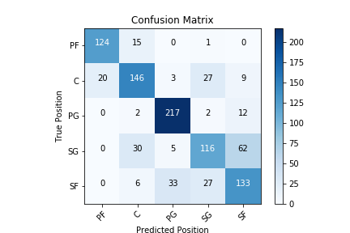
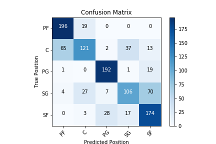
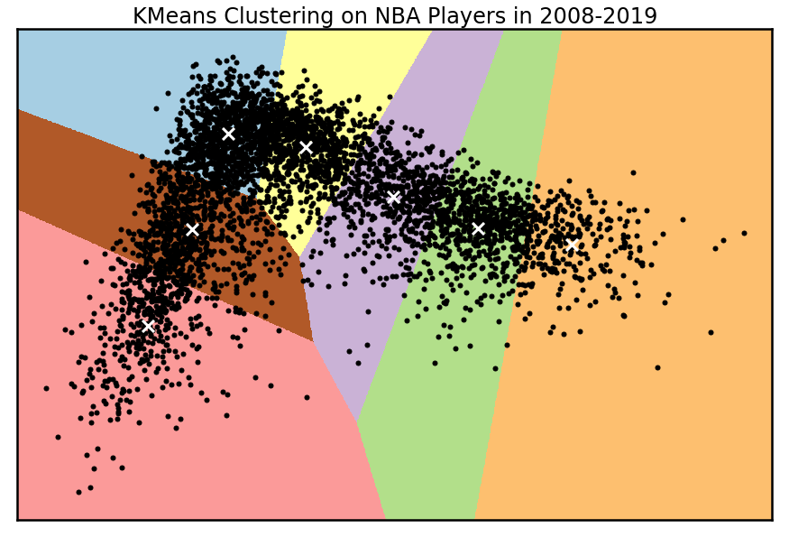

# Modernizing Pro-Basketball Draft and Developmental Decisions with Machine Learning

## Table of Contents

<!--ts-->
 * [Files and Folders of Note](https://github.com/chum46/AI-Scout-Pro-Basketball#files-and-folders-of-note)
 * [General Setup Instructions](https://github.com/chum46/AI-Scout-Pro-Basketball#general-setup-instructions)
 * [Context](https://github.com/chum46/AI-Scout-Pro-Basketball#context)
 * [Goals](https://github.com/chum46/AI-Scout-Pro-Basketball#goals)
 * [Data](https://github.com/chum46/AI-Scout-Pro-Basketball#data)
 * [Results](https://github.com/chum46/AI-Scout-Pro-Basketball#results)
 * [Recommendations](https://github.com/chum46/AI-Scout-Pro-Basketball#business-recommendations)
 * [Future Improvements](https://github.com/chum46/AI-Scout-Pro-Basketball#future-improvements)
<!--te-->

## Files and Folders of Note
```
.
├── README.md
├── data
│   └── readme.md
├── notebooks
│   ├── exploratory
│   │   ├── FSM.ipynb
│   │   ├── cluster_exploration.ipynb
│   │   ├── label_clusters3.ipynb
│   │   ├── label_clusters4.ipynb
│   │   ├── load_data.ipynb
│   │   └── readme.md
│   └── report
│       ├── final_notebook.ipynb
│       └── readme.md
├── reports
│   ├── figures
│   └── presentation.pdf
└── src
    ├── cluster_functions.py
    ├── data_cleaning.py
    ├── model_functions.py
    └── prediction_functions.py
```
#### Repo Navigation Links

 - [presentation.pdf](https://github.com/chum46/AI-Scout-Pro-Basketball/blob/master/reports/presentation.pdf)
 - [/reports](https://github.com/chum46/AI-Scout-Pro-Basketball/tree/master/reports) - contains the final notebook that describes our findings
 - [/notebooks](https://github.com/chum46/AI-Scout-Pro-Basketball/tree/master/notebooks) - contains step by step descriptions of our process including data exploration and model iterations
 - [/src](https://github.com/chum46/AI-Scout-Pro-Basketball/tree/master/src) - contains all scripts that are used in the notebooks/ and reports/ files
 
## General Setup Instructions 

#### 1. Install `ai_scout` conda Environment
This project relies on you using the [`environment.yml`](environment.yml) file to recreate the `ai_scout` conda environment. To do so, please run the following commands *in your terminal*:
```bash
# create the ai_scout conda environment
conda env create -f environment.yml
# activate the ai_scout conda environment
conda activate ai_scout
# if needed, make ai_scout available to you as a kernel in jupyter
python -m ipykernel install --user --name ai_scout --display-name "Python 3 (ai_scout)"
```
Full documentation for managing conda environments can be found [`here`](https://docs.conda.io/projects/conda/en/latest/user-guide/tasks/manage-environments.html).

#### 2. Download Datasets
The following datasets will be used for modeling:
- NBA Advanced Metrics from FiveThirtyEight (csv) 
    - Publicly available: [`repository link`](https://github.com/fivethirtyeight/nba-player-advanced-metrics)
    - Clone repo into the [`data`](/data) folder in this projects main directory.
    ```bash
    # navigate to the data folder and run
    git clone https://github.com/fivethirtyeight/nba-player-advanced-metrics.git
    ```
- NCAA Dataset was provided with written permission from [barttorvik.com](https://barttorvik.com) (csv)
    - In order to work with the data on the site without the need to scrape, get in touch with him [`via twitter`](https://twitter.com/totally_t_bomb) direct message and explain what you will be using it for. If approved, he will provide instructions for obtaining the necessary data. 
    — Follow the provided instructions to create a dataset with the following filters:
        - data from 2008-2019
        - drafted = True
    - Store csv in the [`data`](/data) folder in this projects main directory

#### 3. Create `sqlite3` Database
Instructions can be found in the `create_database` notebook. This database will be used for accessing and saving datasets.


## Context
The new era of the NBA requires versatility to win: 

"I don’t have the five positions anymore. It may be as simple as three positions now, where you’re either a ball-handler, a wing or a big. It's really important. We've become more versatile as the years have gone on." Celtics coach Brad Stevens, per Kareem Copeland of the Associated Press.

Even within a position, players can serve significantly different roles. The Warriors have inspired 'small ball', emphasizing movement and quick transition offense. On the other side of the spectrum, teams like Denver are building around Nikola Jokic, a 'big' listed at 7’0 and 250 pounds. This seems to harken back to a bygone era of the need for a dominant big man, but the comparison gets murky with his ability to shoot the three, average a double-double while ranking in the top 10 in assist percentage. 

Advanced metrics have evolved along with the NBA. This project uses 'RAPTOR' statistics for example, which were developed last year by FiveThirtyEight Sports and is described as:

"A statistic that better reflects how modern NBA teams actually evaluate players. NBA teams highly value floor spacing, defense and shot creation, and they place relatively little value on traditional big-man skills. RAPTOR likewise values these things — not because we made any deliberate attempt to design the system that way but because the importance of those skills emerges naturally from the data. RAPTOR thinks ball-dominant players such as James Harden and Steph Curry are phenomenally good. It highly values two-way wings such as Kawhi Leonard and Paul George. It can have a love-hate relationship with centers, who are sometimes overvalued in other statistical systems. But it appreciates modern centers such as Nikola Jokić and Joel Embiid, as well as defensive stalwarts like Rudy Gobert." 
(Full Article: [Introducing RAPTOR, Our New Metric For The Modern NBA ](https://fivethirtyeight.com/features/introducing-raptor-our-new-metric-for-the-modern-nba/))

Prior to the 2018-19 season, the NBA G League announced a Select Contract as part of a comprehensive professional path that will be available, beginning with the 2019-20 season, to elite prospects who are not yet eligible for the NBA. The contracts, which will include robust programmatic opportunities for development, are for elite players who are at least 18 years old and will pay $125,000 for the five-month season.

With the new opportunity to sign players out of high school, strategies to evaluate player potential and development would be valuable to General Managers. What is the best way to maximize ROI in this new era? How quickly should you pull the plug if there are negative trends? What unique, measurable traits can predict a successful player type? 

## Goals
- Use advanced metrics to better classify modern NBA player roles. 
- Using this new lens, develop a machine learning model to predict a young player's potential NBA classification or player role as they develop. 

With this tool, scouts and front office executives would have a better understanding of a young player's potential career trajectory, track that player's development progress year over year, and help make decisions on contract commitments.

## Data

Descriptions of the statistical categories used can be found in the `readme` file of the [`data`](/data) folder. Follow the [`General Setup Instructions`](https://github.com/chum46/AI-Scout-Pro-Basketball#general-setup-instructions) to download the datasets. 

In order to classify modern nba players, this project uses advanced metrics that take advantage of player tracking and play-by-play data that isn’t available in traditional box scores.

- NBA Advanced Metrics from FiveThirtyEight Sports [`repository link`](https://github.com/fivethirtyeight/nba-player-advanced-metrics)

We'll use historical college statistics of our newly classified modern nba players in order to create the prediction model. Cross Validation will be used to train and test the model. 

- NCAA College statistics are available from [basketball-reference.com](https://basketball-reference.com). The dataset used in this project was obtained through [barttorvik.com](https://barttorvik.com)

## Results

 

 

 

## Business recommendations
Scouts and front office executives can use this this tool for the following purposes:

- View young player's potential career trajectory
- Track player development year over year, adjust strategies 
- Evaluate young players to make decisions on contract commitments
- Better focus scouting on players who would potentially fill needs
 
## Future Improvements:
 - Include international player statistics
 - Explore additional clustering and dimensionality reduction methods 
 - Create a web application for clients using Flask or Dash
 
#### Contact Information:

Chum Mapa: chaminda.mapa@gmail.com
